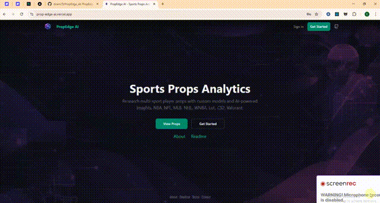

# PropEdge AI - Ultra-MVP

Sports props analytics web app: research player props, build custom models, and get AI-powered insights.


### Full app walkthrough

[](https://github.com/dcam25/PropEdge_AI/blob/main/public/Full.mp4?raw=true)

*Click the preview to watch the full video (MP4)*

> **Creating the GIF:** GitHub only shows inline video as GIFs. Generate `Full.gif` from `Full.mp4` with: `ffmpeg -i public/Full.mp4 -vf "fps=10,scale=640:-1" -t 15 public/Full.gif`

---

## Tech Stack

| Layer | Technology |
|-------|------------|
| **Framework** | Next.js 16 (App Router) |
| **Runtime** | React 19 |
| **Language** | TypeScript 5 |
| **Styling** | Tailwind CSS v4 |
| **Auth & Database** | Supabase |
| **Payments** | Stripe |
| **AI** | OpenAI-compatible API (OpenAI, Grok, Claude, etc.) |
| **Deploy** | Vercel |

---

## Packages Used

### Core
- **next** (16.1) – App Router, API routes, server components
- **react** (19.2), **react-dom** (19.2) – UI library
- **typescript** (5.x) – Type safety

### Forms & Validation
- **react-hook-form** (7.x) – Form state and submission
- **@hookform/resolvers** (5.x) – Zod resolver for react-hook-form
- **zod** (4.x) – Schema validation (signup, profile, password)

### UI (Radix UI)
- **@radix-ui/react-dialog** – Modal dialogs
- **@radix-ui/react-tabs** – Tabs
- **@radix-ui/react-slot** – Polymorphic `asChild`
- **@radix-ui/react-dropdown-menu** – Dropdown menus
- **@radix-ui/react-select** – Select inputs
- **@radix-ui/react-toast** – Toast notifications

### UI Utilities & Styling
- **class-variance-authority (cva)** – Variant-based component styling
- **clsx** – Conditional class names
- **tailwind-merge** – Merge Tailwind classes
- **lucide-react** – Icons
- **flowbite-react** – Datepicker (birthday)
- **framer-motion** – Animations
- **react-transition-group** – Transitions
- **sonner** – Toast notifications

### Modals & Charts
- **react-modal-hook** – Modal hooks
- **recharts** – Charts (dashboard)

### State & Data
- **zustand** – Auth store
- **@faker-js/faker** – Mock data
- **mocker-data-generator** – Mock data generation

### Supabase
- **@supabase/supabase-js** – Supabase client
- **@supabase/ssr** – Next.js server/client auth

### Stripe
- **stripe** – Payments, subscriptions, balance, webhooks

### Dev
- **patch-package** – Patch node_modules (flowbite-react)
- **eslint**, **eslint-config-next** – Linting
- **tailwindcss**, **@tailwindcss/postcss** – Tailwind v4

---

## Supabase
- **Auth** – Email/password signup and login
- **PostgreSQL** – `profiles`, `user_models`, `stripe_customers`
- **Row Level Security (RLS)** – Per-user data access
- **Realtime** – Available for future live updates

**Packages:** `@supabase/supabase-js`, `@supabase/ssr` (for Next.js server/client auth)

### Supabase project video

<video src="public/Supabase_project.mp4" controls width="640"></video>

*Supabase project overview — auth, database tables, RLS, API, and more. See the Readme page in the app (`/readme`) for the full walkthrough with timestamps.*

**Supabase clients** – Use the correct client for each context:

| Context | Import | Use for |
|---------|--------|---------|
| **Browser** (client components, hooks) | `createClient` from `@/lib/supabase/client` | User-triggered actions, auth state, RLS queries from the frontend |
| **Server** (API routes, Server Actions, Server Components) | `createClient` from `@/lib/supabase/server` | Auth-required API logic, webhooks, server-side data access |

The server client uses `cookies()` from `next/headers` and **cannot run in the browser**. For auth-required actions from the frontend, either call the browser client directly or invoke an API route / Server Action that uses the server client.

### Stripe
- **Checkout** – Subscription flow ($19.99/mo) via `/api/stripe/checkout`
- **Customer Portal** – Manage/cancel via `/api/stripe/portal`
- **Webhook** – `/api/stripe/webhook` handles `checkout.session.completed`, `customer.subscription.*`, `invoice.paid`; updates `profiles.is_premium`, `stripe_customers`, balance
- **Balance** – Add credit ($10+ min) via `/api/stripe/charge-balance`; purchase Premium with balance via `/api/premium/purchase-with-balance`

**Package:** `stripe`

### AI (OpenAI-compatible)
- **Chat completions** – Prop insight generation via `/api/ai-insight`
- **Providers** – OpenAI, Grok, Claude, or any API using the OpenAI format

**Config:** `AI_API_KEY`, `AI_API_URL`, `AI_MODEL` in `.env`

---

## API Endpoints

| Endpoint | Method | Purpose | Used in |
|----------|--------|---------|---------|
| `/api/ai-insight` | POST | Generate AI insight for a prop | Dashboard → Prop detail modal |
| `/api/stripe/checkout` | POST | Create Stripe Checkout session | Profile → Plan → Subscribe |
| `/api/stripe/portal` | POST | Redirect to Stripe Customer Portal | Profile → Plan → Manage |
| `/api/stripe/webhook` | POST | Receive Stripe events (subscription, checkout, invoice) | Stripe (external) |
| `/api/stripe/charge-balance` | POST | Add balance credit ($10+ min) | Profile → Balance → Add balance |
| `/api/stripe/subscription` | GET | Get current subscription status | Prop detail modal (Premium gate) |
| `/api/premium/purchase-with-balance` | POST | Purchase Premium with Stripe balance | Profile → Plan → Upgrade |
| `/api/invoices` | GET | Balance, transactions, subscription end | Profile → Balance & Transactions |
| `/api/user/delete` | POST | Delete user account | Profile → Delete account |
| `/auth/callback` | GET | Handle Supabase auth redirect (OTP, magic link) | Supabase redirect URL |

### Stripe Webhook

Configure in Stripe Dashboard → Developers → Webhooks. Add your **webhook destination** (endpoint URL) so Stripe knows where to send events. Endpoint: `https://your-domain.com/api/stripe/webhook`.

**Events to subscribe:**
- `checkout.session.completed` – Upsert stripe_customers, sync balance_credit
- `customer.subscription.created`, `customer.subscription.updated` – Update profiles.is_premium
- `customer.subscription.deleted` – Set profiles.is_premium = false
- `invoice.paid` – Sync subscription payments, fallback user lookup

Copy the webhook signing secret to `STRIPE_WEBHOOK_SECRET` in env.

---

## Project Structure

```
src/
├── app/
│   ├── (auth)/login, signup     # Auth pages
│   ├── api/                     # AI insight, Stripe checkout/webhook/portal
│   ├── auth/callback/           # Supabase auth redirect handler
│   ├── dashboard/               # Props table + pick builder
│   ├── models/                  # Model builder
│   └── pricing/                 # Subscription plans
├── components/                  # UI + feature components
├── stores/                       # Zustand auth store
├── data/                        # Mock props
├── lib/                         # Supabase clients, validations (Zod schemas), model scoring, utils
└── types/                       # TypeScript types
```

---

## Quick Start

```bash
npm install
cp .env.example .env.local
# Fill in Supabase, Stripe, AI keys
npm run dev
```

## Setup

1. **Supabase:** Create project, run `supabase/migrations/001_initial_schema.sql` in SQL Editor.
2. **Stripe:** Create Product + Price ($19.99/mo), add webhook for subscription events.
3. **AI:** Set `AI_API_KEY` (OpenAI, Grok, or any OpenAI-compatible API).

---

## Vercel Deploy

1. **Connect repo** – Push to GitHub, then import the project in [Vercel](https://vercel.com).
2. **Environment variables** – Add all env vars from `.env` in Vercel Project Settings → Environment Variables:
   - `NEXT_PUBLIC_SUPABASE_URL`, `NEXT_PUBLIC_SUPABASE_ANON_KEY`, `SUPABASE_SERVICE_ROLE_KEY`
   - `STRIPE_SECRET_KEY`, `STRIPE_WEBHOOK_SECRET` (use Vercel’s URL for webhook)
   - `AI_API_KEY`, `AI_API_URL`, `AI_MODEL`
   - Optional: `ADMIN_SECRET` for admin APIs
3. **Stripe webhook** – In Stripe Dashboard, set the webhook URL to `https://your-app.vercel.app/api/stripe/webhook`.
4. **Supabase redirect** – In Supabase Auth → URL Configuration, add `https://your-app.vercel.app/auth/callback` as a redirect URL.

## Features

### Core
- **Dashboard** – Props table across NBA, NFL, MLB, NHL, WNBA, LoL, CS2, Valorant; filter by sport, date, search
- **Prop detail modal** – View prop stats, AI-powered insight (OpenAI/Grok/Claude), add to picks
- **Pick builder** – Build a slip, copy-for-PrizePicks/Underdog export
- **Model builder** – 7 weighted factors (recent form, matchup, pace, usage, home/away, rest, sample size), backtesting, set active model

### Auth & Profile
- **Auth** – Email/password signup & login, OTP (6-digit code), forgot password, email confirmation
- **Profile** – Edit name, birthday; change password; delete account
- **Plan** – Free vs Premium ($19.99/mo), upgrade via Stripe Checkout or balance

### Balance & Transactions
- **Balance** – Add credit ($10+ min) via Stripe; view balance and transaction history
- **Purchase with balance** – Upgrade to Premium using Stripe customer balance

### Limits
- **Free** – 1 model, 5 AI insights/day
- **Premium** – 10 models, unlimited AI insights

## About Page & Hero Image

The `/about` page describes the app and focuses on **Supabase** and **Stripe** integration. To add a dashboard screenshot:

1. Save your image as `public/about-hero.png`
2. It will display on the About page; if missing, a placeholder is shown

## Docs

See [docs/README.md](docs/README.md) for schema, model scoring, and API integration.
